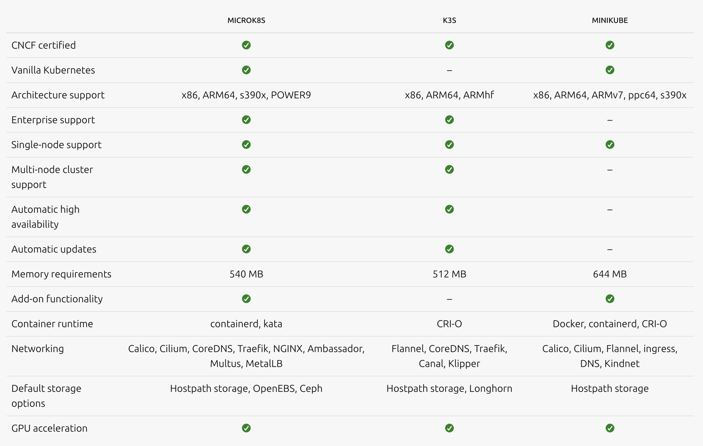

# Final Project Skalabilitas dan Reliabilitas Sistem

## Capaian Pembelajaran Mata Kuliah (CPMK)

1. Mampu memahami konsep dan Skalabilitas dan Reliabilitas pada Sistem

2. Mampu menggunakan tools terkini untuk meningkatkan skalabilitas dan reliabilitas sistem

3. Mampu membuat sebuah sistem yang scalable dan reliable

4. Mampu melakukan ujicoba skalabilitas dan reliabilitas terhadap sistem

## Ketentuan Final Project (FP)

1. FP dikerjakan secara berkelompok dengan anggota minimal 3 orang dan maksimal 4 orang
2. Waktu pengerjaan hingga tanggal 6 Juli 2024 (Tentatif menyesuaikan situasi dan kondisi)
3. FP dikerjakan dengan menggunakan VM yang sudah disediakan
4. Jumlah nodes yang digunakan adalah sejumlah anggota kelompok
5. Laporan FP dikerjakan dalam bentuk github markdown

## Soal Final Project

Pada pertemuan sebelumnya kalian telah mempelajari tools untuk containerization dan orchestration serta sistem untuk memonitor nya. Contoh implementasinya menggunakan Kubernetes dan Docker untuk mendeploy sebuah aplikasi Sentiment Analysis berbasis microservice. 

Namun saat implementasi di kelas kalian masih menggunakan 1 node sebagai hostnya. dan menggunakan minikube sebagai Tools untuk mempelajari kubernetes. Pada final project ini kalian diminta membuat sistem yang [sama](https://github.com/rinormaloku/k8s-mastery) namun lebih scalable menggunakan banyak nodes. untuk dapat menggunakan multi nodes, kalian dapat menggunakan implementasi selain minikube misal microK8s, k3s, k0s dll. Sebagai perbandingan sederhana dapat dilihat pada tabel berikut

Dari sini output yang dijadikan penilaian dari Final Project ini adalah

1. Mampu mengimplementasikan kubernetes dan docker dengan multiple nodes/host (50%)
    - Tampilkan bagaimana arsitektur infrastruktur yang dibuat menggunakan multiple nodes (tidak ada aturan khusus terkait arsitektur infrastruktur) 
    - Tampilkan langkah langkah implementasinya
    - Tampilkan bahwa aplikasi dapat diakses dengan semestinya

2. Mampu membuat sebuah sistem yang dapat termonitor dengan baik. dapat menggunakan grafana dan prometheus atau stack lainnya seperti kubernetes dashboard. (25%)
    - tampilkan langkah pembuatan sistem monitor
    - tampilkan apa saja yang dapat di monitor

3. Mampu melakukan load testing menggunakan tools, seperti locust atau Jmeter untuk menguji performa sistem (20%)
    - tampilkan cara melakukan load testing
    - tampilkan hasil load testing

4. Analisis dan kesimpulan (5%)
